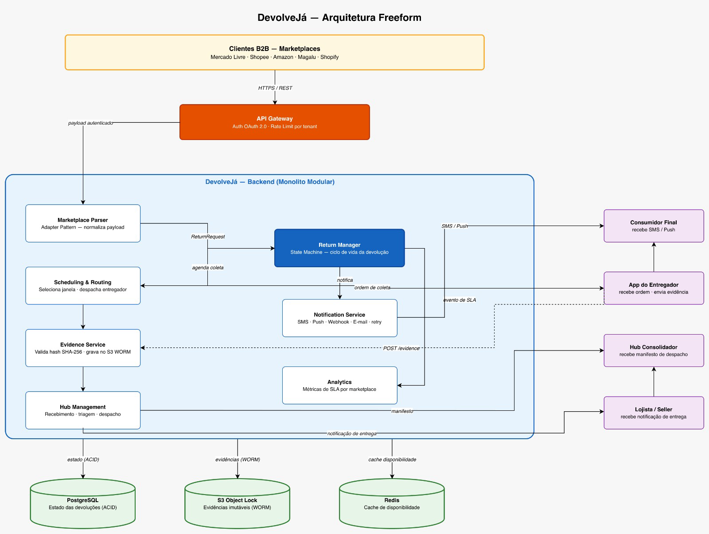
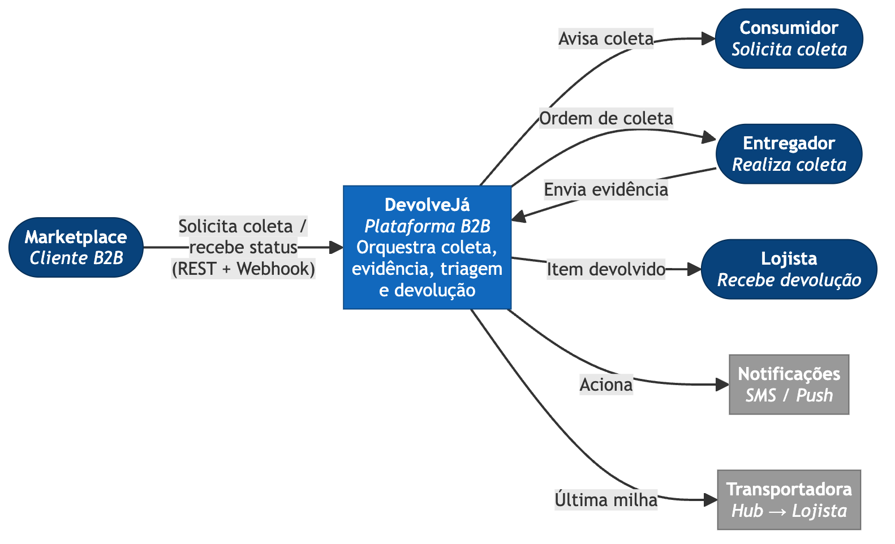
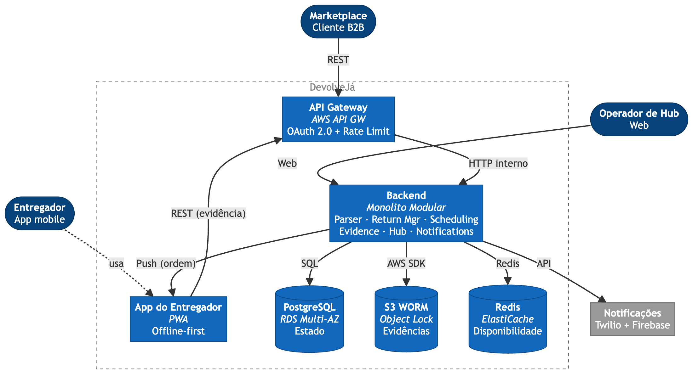
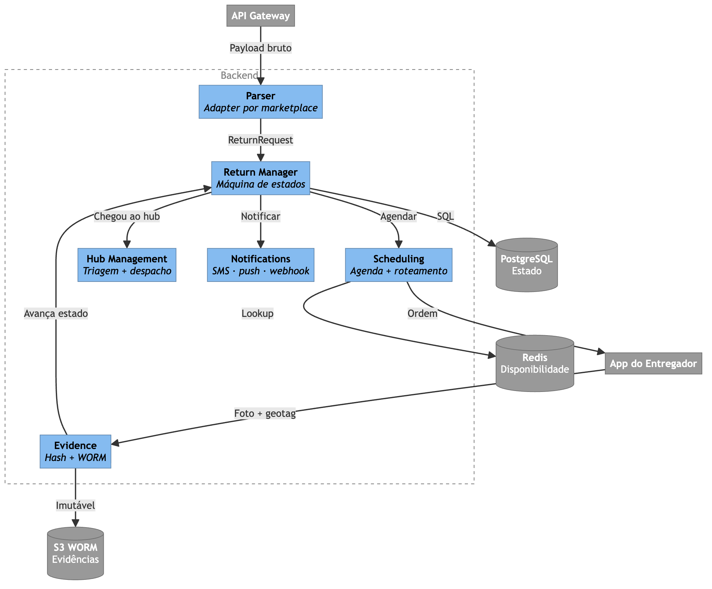

# DevolveJá — Plataforma de Logística Reversa Domiciliar para E-commerce

Plataforma B2B que orquestra a **coleta de devoluções no endereço do consumidor** sob demanda dos marketplaces (Mercado Livre, Shopee, Amazon, Magalu) e e-commerces independentes, eliminando a ida do cliente aos Correios ou pontos físicos.

---

### Gravação
https://drive.google.com/drive/folders/1kQ8ZI4yLvyp3VSE6d8Fdr4lPKbVZJPqt

---

## Equipe

| Nome | RM 
|------|----|
| David Campos | 361099 | 
| Flavia Nitto | 363758 | 
| Julio Coelho | 363941 | 
| Omar Ali | 365431 | 

**Professor:** Leonardo Pinho — profleonardo.pinho@fiap.com.br

---

## Índice

1. [Montar um Story Telling sobre o problema que você resolve e definir o tema](#1-montar-um-story-telling-sobre-o-problema-que-você-resolve-e-definir-o-tema)
2. [O que esperamos aprender com esse projeto?](#2-o-que-esperamos-aprender-com-esse-projeto)
3. [Que perguntas precisamos que sejam respondidas?](#3-que-perguntas-precisamos-que-sejam-respondidas)
4. [Quais são os nossos principais riscos?](#4-quais-são-os-nossos-principais-riscos)
5. [Crie um plano para aprender o que precisamos para responder a perguntas específicas](#5-crie-um-plano-para-aprender-o-que-precisamos-para-responder-a-perguntas-específicas)
6. [Crie um plano para reduzir riscos](#6-crie-um-plano-para-reduzir-riscos)
7. [Quem são as partes interessadas?](#7-quem-são-as-partes-interessadas)
8. [O que eles esperam ganhar?](#8-o-que-eles-esperam-ganhar)
9. [Quem são os usuários?](#9-quem-são-os-usuários)
10. [O que eles estão tentando realizar?](#10-o-que-eles-estão-tentando-realizar)
11. [Qual o pior que pode acontecer?](#11-qual-o-pior-que-pode-acontecer)
12. [Desenhe uma arquitetura — Modelo Freeform (Versão inicial)](#12-desenhe-uma-arquitetura--modelo-freeform-versão-inicial)
13. [Faça uma descrição de cada um dos componentes que você desenhou](#13-faça-uma-descrição-de-cada-um-dos-componentes-que-você-desenhou)
14. [Descreva requisitos que você(s) considera importante e por quê? (Mínimo 5)](#14-descreva-requisitos-que-vocês-considera-importante-e-por-quê-mínimo-5)
15. [Sobre o que o diagrama ajuda você a raciocinar/pensar?](#15-sobre-o-que-o-diagrama-ajuda-você-a-raciocinarpensar)
16. [Quais são os padrões essenciais no diagrama?](#16-quais-são-os-padrões-essenciais-no-diagrama)
17. [Existem padrões ocultos?](#17-existem-padrões-ocultos)
18. [Qual é o Metamodelo?](#18-qual-é-o-metamodelo)
19. [Pode ser discernido no diagrama único?](#19-pode-ser-discernido-no-diagrama-único)
20. [O diagrama está completo?](#20-o-diagrama-está-completo)
21. [Poderia ser simplificado e ainda assim ser eficaz?](#21-poderia-ser-simplificado-e-ainda-assim-ser-eficaz)
22. [Houve alguma discussão importante que vocês tiveram como equipe?](#22-houve-alguma-discussão-importante-que-vocês-tiveram-como-equipe)
23. [Que decisões sua equipe teve dificuldade para tomar?](#23-que-decisões-sua-equipe-teve-dificuldade-para-tomar)
24. [Que decisões foram tomadas sob incerteza?](#24-que-decisões-foram-tomadas-sob-incerteza)
25. [Houve algum ponto de decisão sem retorno que o forçou a desistir de uma determinada escolha?](#25-houve-algum-ponto-de-decisão-sem-retorno-que-o-forçou-a-desistir-de-uma-determinada-escolha)
26. [Desenhe 3 Arquiteturas com o projeto que você desenvolveu na aula em cada uma das camadas do C4](#26-desenhe-3-arquiteturas-com-o-projeto-que-você-desenvolveu-na-aula-em-cada-uma-das-camadas-do-c4)
27. [Nível Contexto](#27-nível-contexto)
28. [Nível Container](#28-nível-container)
29. [Nível Componente](#29-nível-componente)
31. [Validar no checklist (opcional)](#31-validar-no-checklist-opcional)

---

## 1. Montar um Story Telling sobre o problema que você resolve e definir o tema

**Problema.** A logística direta (loja → cliente) está madura e disputada por iFood, Rappi, Loggi e Uber Direct. Já a **logística reversa** (cliente → loja) continua manual e analógica: o consumidor precisa imprimir etiqueta, embalar, ir aos Correios ou a um ponto de coleta, enfrentar fila e aguardar protocolo. O resultado é alto custo de NPS para o marketplace, alta taxa de abandono de troca/devolução e fricção que reduz a conversão de vendas futuras.

**Solução.** API B2B que os marketplaces integram ao seu fluxo de devolução. Quando o cliente solicita a devolução, a DevolveJá agenda uma janela de 30 minutos, despacha um entregador parceiro com lacre digital e bag rastreável, faz a coleta com foto de comprovação e leva a mercadoria a um *hub* consolidador, onde é triada e devolvida ao lojista de origem.

**Tema:** *Plataforma B2B de orquestração logística reversa domiciliar.*

---

## 2. O que esperamos aprender com esse projeto?

- Modelar um sistema **B2B multi-tenant** com integração via API para clientes com SLAs distintos.
- Aplicar **estilos arquiteturais** distintos e justificar trade-offs — incluindo a decisão consciente de começar com monolito modular em vez de microsserviços.
- Decidir **trade-offs de consistência, latência e custo** num domínio com janelas agendadas.
- Comunicar a mesma arquitetura em três níveis com o **modelo C4**.

---

## 3. Que perguntas precisamos que sejam respondidas?

| # | Pergunta | Decisão arquitetural que afeta |
|---|----------|--------------------------------|
| Q1 | Qual o pico de coletas/dia em Black Friday + 30 dias? | Capacidade de cache e *workers* de roteirização |
| Q2 | Como garantir não-repúdio da coleta (foto, lacre, geolocalização)? | Evidence Service com *write-once storage* |
| Q3 | Como tratar áreas sem cobertura de rede no momento da coleta? | App entregador *offline-first* com sincronização local |
| Q4 | Como garantir LGPD num fluxo que passa por marketplace, plataforma, entregador e hub? | *Privacy by design*, tokenização de PII |
| Q5 | Como integrar com APIs heterogêneas dos marketplaces (ML, Shopee, Amazon)? | *MarketplaceParser* por marketplace (Adapter Pattern) |

---

## 4. Quais são os nossos principais riscos?

| ID | Risco | Prob. | Impacto | Categoria |
|----|-------|-------|---------|-----------|
| R1 | Marketplaces desenvolverem solução própria internalizada | Alta | Crítico | Negócio |
| R2 | Falha de roteirização gera SLA descumprido com marketplace | Média | Crítico | Técnico |
| R3 | Fraude — entregador troca ou extravia a mercadoria | Alta | Crítico | Operacional |
| R4 | Vazamento de PII (endereço do consumidor + valor da mercadoria) | Baixa | Crítico | Segurança/LGPD |
| R5 | Dependência de APIs de marketplaces com *breaking changes* não anunciadas | Alta | Alto | Integração |

---

## 5. Crie um plano para aprender o que precisamos para responder a perguntas específicas

| Pergunta | Ação | Sprint |
|----------|------|--------|
| Q1 | Benchmark público (Magalu, B2W) + simulação de pico | 1 |
| Q2 | Estudo de *evidence chain*: lacre + hash + WORM | 1 |
| Q3 | Spike: PWA offline + sincronização ao reconectar | 2 |
| Q4 | Guia ANPD + mapeamento de PII no fluxo | 1 |
| Q5 | Análise das APIs públicas (ML, Shopee, Magalu) | 1 |

---

## 6. Crie um plano para reduzir riscos

| Risco | Ação |
|-------|------|
| R1 | Começar pelos e-commerces médios; grandes marketplaces só depois de provar volume |
| R2 | Cache no Redis + janela de 2h em pico (degradação graciosa) |
| R3 | Evidência imutável desde o MVP: lacre + foto + hash em S3 WORM |
| R4 | Tokenizar PII, cifrar em trânsito e em repouso, acesso por escopo |
| R5 | Parser isolado por marketplace + testes com payload real |

---

## 7. Quem são as partes interessadas?

| Stakeholder | Tipo | Influência |
|-------------|------|------------|
| Marketplaces e e-commerces (clientes B2B) | Externo | Crítica |
| Entregadores parceiros | Externo | Alta |
| Engenharia | Interno | Alta |
| Consumidores finais (usuários da coleta) | Externo | Média |
| Jurídico / *Compliance* | Interno | Média |

---

## 8. O que eles esperam ganhar?

- **Marketplaces e e-commerces:** menos NPS negativo no pós-venda, custo unitário menor que Correios e evidência irrefutável em disputas — sem precisar construir logística própria.
- **Entregadores parceiros:** ganho/hora competitivo em janelas previsíveis, agenda visível e repasse transparente.
- **Engenharia:** arquitetura simples de operar, *deploy* contínuo com baixo *toil* operacional.
- **Consumidores finais:** devolver sem sair de casa, sem fila e sem imprimir etiqueta.
- **Jurídico / Compliance:** zero incidentes reportáveis à ANPD e rastreabilidade completa do acesso a dados sensíveis.

---

## 9. Quem são os usuários?

**Primários:**

- **Marketplace / e-commerce parceiro** (cliente B2B) — integra a API ao fluxo de devolução. Sensível a SLA, taxa de sucesso, custo unitário e qualidade da evidência digital.
- **Entregador parceiro** — autônomo, executa coleta e transporte ao hub. Sensível a ganho/hora e previsibilidade da agenda.
- **Operador do hub consolidador** — recebe, tria e despacha as devoluções ao lojista. Sensível a fluxo previsível e sistema de triagem confiável.

**Secundários:**

- **Consumidor final** — usuário do serviço, mas não cliente direto. Sensível a janela cumprida e simplicidade.
- **Operador de suporte** — resolve disputas (item ausente, lacre violado, divergência).

---

## 10. O que eles estão tentando realizar?

| Persona | *Job* | *Outcome* |
|---------|-------|-----------|
| Marketplace | Reduzir fricção da devolução sem montar logística própria | Integração em < 2 sprints, SLA ≥ 95% |
| Marketplace | Ter evidência irrefutável da coleta | Foto + geotag + lacre + timestamp assinado |
| Entregador | Maximizar ganho/hora com previsibilidade | Agenda do dia visível, rotas otimizadas |
| Operador de hub | Receber volume previsível e bem identificado | Etiqueta digital com checklist de triagem |
| Consumidor | Devolver sem sair de casa nem imprimir nada | Zero etiqueta física, janela de 30 min cumprida |

---

## 11. Qual o pior que pode acontecer?

| Cenário | Severidade | Justificativa |
|---------|------------|---------------|
| Vazamento massivo de PII (endereços + valores) | Catastrófico | Multa LGPD, risco de uso por crime organizado, perda imediata de contratos B2B |
| Falha sistêmica em pico pós-Black Friday | Crítico | Quebra de SLA com vários marketplaces ao mesmo tempo, multas contratuais |
| Fraude orquestrada de entregadores | Catastrófico | Marketplace deixa de confiar na evidência digital, modelo perde valor |
| Marketplace-chave internalizar a operação | Crítico | Perda de até 40% do GMV se houver concentração |
| Breaking change não anunciada na API do marketplace | Alto | Coleta interrompida até hotfix; impacto direto no SLA |

---

## 12. Desenhe uma arquitetura — Modelo Freeform (Versão inicial)



**Fluxo principal:**
`Marketplace solicita → API Gateway → Parser → Return Manager → agenda coleta → entregador coleta com evidência → hub tria → lojista recebe.`

---

## 13. Faça uma descrição de cada um dos componentes que você desenhou

| # | Componente | Função | Tecnologia | Decisão chave | RNFs |
|---|------------|--------|------------|---------------|------|
| **C1** | API Gateway | Entrada única; valida OAuth 2.0 e aplica rate limit por tenant | AWS API GW / Kong | Isola auth e throttling — tenant mal-configurado não derruba os demais | RNF1, RNF4 |
| **C2** | Marketplace Parser | Normaliza payload de cada marketplace para `ReturnRequest` (uma função por marketplace) | Módulo do monolito | Evita ACL formal no MVP; fácil de testar e estender | RNF6 |
| **C3** | Return Manager | Orquestra ciclo de vida da devolução via máquina de estados (`REQUESTED → DELIVERED`) | Módulo + PostgreSQL | Estado ACID garante rastreabilidade e auditoria | RNF1, RNF6 |
| **C4** | Scheduling & Routing | Consulta disponibilidade no Redis e envia ordem ao entregador; janela de 2h em pico | Módulo + Redis | Cache protege o banco; degradação preserva SLA mínimo | RNF2, RNF3 |
| **C5** | Evidence Service | Valida hash SHA-256 da foto + geotag + lacre e grava em S3 imutável (retenção 5 anos) | Módulo + S3 Object Lock | Não-repúdio por infraestrutura, não por código | RNF4 |
| **C6** | Hub Management | Recebimento, triagem por lojista e manifesto de despacho | Módulo + web interna | Sem handoff entre módulos no MVP | RNF5, RNF6 |
| **C7** | Notification Service | Centraliza SMS, push e webhooks com retry e backoff exponencial | Módulo + Twilio / Firebase | Concentra credenciais e lógica de retry em um lugar só | RNF1, RNF5 |

---

## 14. Descreva requisitos que você(s) considera importante e por quê? (Mínimo 5)

| # | Requisito | Métrica | Por quê é importante |
|---|-----------|---------|----------------------|
| **RNF1** | Disponibilidade | 99,9% uptime (≤ 8,7h/ano de downtime) | Plataforma B2B com SLA contratual; indisponibilidade gera multa e perda de marketplace |
| **RNF2** | Desempenho | Confirmação de janela de coleta < 2s (P95) | Marketplace chama a API de forma síncrona no fluxo do consumidor — latência alta quebra a UX |
| **RNF3** | Escalabilidade | Suportar 15x o volume médio sem degradação de funcionalidades críticas | Pico previsível e intenso no pós-Black Friday — arquitetura deve absorver sem redesign |
| **RNF4** | Segurança e LGPD | Zero incidentes reportáveis à ANPD; PII tokenizada em trânsito | Endereço do consumidor + valor do pedido são dados sensíveis |
| **RNF5** | Observabilidade | Dashboards de SLA por marketplace em tempo real; alertas em < 5min | Marketplaces exigem relatórios; ops precisa detectar falhas antes do cliente |
| **RNF6** | Manutenibilidade | Zero-downtime deploy; módulos testáveis isoladamente | Time pequeno no MVP — ciclos rápidos reduzem dívida técnica |

---

## 15. Sobre o que o diagrama ajuda você a raciocinar/pensar?

- **Onde ficam as fronteiras de segurança:** o API Gateway separa o mundo externo do domínio interno. O Evidence Service é o único ponto que escreve no S3 imutável. Isso torna evidente onde concentrar os controles de acesso.
- **Onde o fluxo é síncrono vs. assíncrono:** a resposta ao marketplace (confirmação de janela) precisa ser síncrona e rápida; as notificações ao consumidor e ao lojista podem ser assíncronas. O diagrama expõe essa divisão visualmente.
- **Qual componente carrega o estado:** o Return Manager é o único responsável pela máquina de estados. Todos os outros módulos são acionados por ele, nunca o contrário — previne estado distribuído implícito.
- **Onde estão os pontos de pressão em pico:** o Scheduling & Routing é o módulo que mais recebe carga simultânea. O diagrama torna óbvio que ele precisa de cache (Redis) para não pressionar o banco a cada consulta.

---

## 16. Quais são os padrões essenciais no diagrama?

| Padrão | Onde se aplica | Por que foi escolhido |
|--------|----------------|------------------------|
| **Monolito Modular** | Backend | MVP com time pequeno — evita overhead operacional de microsserviços prematuros; módulos bem separados permitem extração futura sem reescrita |
| **Adapter / Parser por Marketplace** | Marketplace Parser | Cada marketplace tem payload distinto; um parser isolado protege o domínio sem o overhead de uma ACL completa |
| **API Gateway** | Camada de entrada | Separação clara entre infraestrutura (auth, rate limiting, TLS) e lógica de negócio |
| **Máquina de Estados** | Return Manager | Ciclo de vida com transições bem definidas previne estados inválidos e facilita auditoria |
| **Write-Once Storage (WORM)** | Evidence Service | Não-repúdio é requisito do negócio — S3 Object Lock implementa isso nativamente |

---

## 17. Existem padrões ocultos?

| Padrão | Onde se manifesta |
|--------|-------------------|
| **Idempotência** | O App do Entregador pode reenviar evidências em caso de falha de rede — o Evidence Service aceita a mesma evidência mais de uma vez sem duplicar |
| **Degradação Graciosa** | Em pico, o Scheduling abre janelas de 2h em vez de 30 min — o sistema continua operando com SLA reduzido, mas não quebra |
| **Cache-Aside** | O Redis armazena disponibilidade de entregadores; o Scheduling consulta o cache antes do banco |
| **Retry com Backoff Exponencial** | Notification Service tenta reenviar webhooks com espera exponencial antes de marcar como falha |

---

## 18. Qual é o Metamodelo?

```
ESTILO PRINCIPAL: Monolito Modular (MVP)
  └── Módulos internos com interfaces bem definidas
  └── Banco de dados único compartilhado (PostgreSQL)
  └── Evolução planejada para microsserviços com dor real

ESTILO DE INTEGRAÇÃO: API-First (REST)
  └── Contratos OpenAPI por marketplace
  └── Webhooks para notificações assíncronas de saída

ESTILO DE DADOS:
  └── Estado transacional → PostgreSQL (ACID)
  └── Evidências → S3 WORM (imutável)
  └── Cache de disponibilidade → Redis (consistência eventual)

ESTILO DE SEGURANÇA: Defense in Depth
  └── API Gateway (autenticação / autorização por tenant)
  └── Tokenização de PII (LGPD)
  └── Write-once para evidências (não-repúdio)
```

---

## 19. Pode ser discernido no diagrama único?

Não — e isso é intencional. Um diagrama único que tentasse mostrar todos os níveis ao mesmo tempo seria ilegível.

O diagrama freeform (item 12) serve para raciocinar sobre o sistema como um todo, mas não é suficiente para comunicar responsabilidades internas, tecnologias ou fluxos de dados com precisão. Por isso adotamos o **modelo C4**, que divide a arquitetura em três camadas complementares:

- **Contexto:** quem interage com o sistema e como — suficiente para stakeholders não-técnicos
- **Container:** o que roda e onde — suficiente para decisões de infra e deploy
- **Componente:** como cada container é estruturado internamente — suficiente para o time de desenvolvimento

Cada diagrama é discernível por conta própria dentro do seu nível de abstração. A consistência entre eles (os mesmos elementos com nomes idênticos) garante leitura conjunta sem ambiguidade.

---

## 20. O diagrama está completo?

| Requisito do sistema | Coberto? | Componente responsável |
|----------------------|----------|------------------------|
| Solicitar devolução (marketplace) | ✅ | API Gateway + Parser + Return Manager |
| Agendar coleta com entregador | ✅ | Scheduling & Routing |
| Capturar evidência digital | ✅ | Evidence Service + S3 |
| Gerenciar triagem no hub | ✅ | Hub Management |
| Notificar todas as partes | ✅ | Notification Service |
| Proteção de PII / LGPD | ✅ | Tokenização + acesso restrito por escopo |
| Suporte a pico de demanda | ✅ | Redis cache + degradação graciosa |
| Detecção de fraude por ML | ⚠️ | Não no MVP — previsto para v2 com volume real |

---

## 21. Poderia ser simplificado e ainda assim ser eficaz?

Sim — e várias simplificações foram deliberadamente escolhidas. A tabela documenta o que foi simplificado, o que essa escolha evita e quando deve ser revisitada:

| Decisão | Complexidade evitada | Quando revisar |
|---------|----------------------|----------------|
| Monolito modular em vez de microsserviços | Sem Kafka, service mesh, distributed tracing complexo | Quando 3+ módulos tiverem picos de escala independentes |
| PostgreSQL único em vez de bancos por domínio | Sem consistência distribuída | Quando um módulo precisar de schema radicalmente diferente |
| `MarketplaceParser` em vez de ACL formal | Sem camada de serviço extra, sem infra dedicada | Mais de 4 marketplaces com formatos radicalmente distintos |
| Sem motor de fraude no MVP | Sem modelo ML para treinar e manter | Quando o volume gerar dados suficientes (3-6 meses de operação) |
| Webhooks em vez de event bus | Sem Kafka, sem consumers, sem DLQ | Quando o volume de eventos ultrapassar 10k/min |

---

## 22. Houve alguma discussão importante que vocês tiveram como equipe?

- **Monolito modular vs. microsserviços** — discussão central. Microsserviços trariam separação clara e escala independente, mas o custo operacional (rede entre serviços, rastreabilidade distribuída, deploys coordenados) consome capacidade de produto num time pequeno. Vencedor: monolito modular, com gatilho explícito de revisão.
- **Parser por marketplace vs. Anti-Corruption Layer formal** — vencedor: parser, suficiente para 1-2 marketplaces no MVP. A ACL fica como evolução natural.
- **B2B-first vs. app B2C próprio** — vencedor: B2B, monetiza por contrato com marketplace em vez de construir marca direta ao consumidor.

---

## 23. Que decisões sua equipe teve dificuldade para tomar?

- **Janela padrão de coleta (30 min vs. 2h)** — 30 min ganha em UX, mas exige densidade de frota. Vencedor: 30 min com fallback automático para 2h em pico (degradação graciosa).
- **PostgreSQL único vs. bancos por domínio** — isolamento custa consistência distribuída. Vencedor: banco único no MVP, com gatilho de revisão se um módulo demandar schema radicalmente diferente.
- **Evidência síncrona vs. eventual** — fraude pesa mais que latência. Vencedor: gravação síncrona no S3 antes de avançar o estado da devolução.

---

## 24. Que decisões foram tomadas sob incerteza?

- **Volume real de pico pós-Black Friday** — sem histórico próprio, estimado a partir de benchmark público (Magalu, B2W).
- **TTL do cache Redis (30s)** — escolhido empiricamente; depende de quantos entregadores ficam offline simultaneamente. Ajuste previsto após primeiros 3 meses em produção.
- **Cobertura em regiões com sinal ruim** — PWA offline-first projetado sem teste de campo.

---

## 25. Houve algum ponto de decisão sem retorno que o forçou a desistir de uma determinada escolha?

- **S3 Object Lock por 5 anos** — uma vez ativado, o bucket não pode ser desligado e os objetos não podem ser apagados dentro do prazo regulatório. Decisão deliberada — é justamente a propriedade que garante o não-repúdio.
- **API B2B-first em vez de app B2C próprio** — entrar depois no B2C exige reposicionamento de marca e nova base de usuários.
- **Modelo de entregador autônomo** — mudança trabalhista (risco R5 ampliado) inviabiliza o modelo e exige redesenho contratual.

---

## 26. Desenhe 3 Arquiteturas com o projeto que você desenvolveu na aula em cada uma das camadas do C4

### 27. Nível Contexto



### 28. Nível Container



### 29. Nível Componente (Backend)


